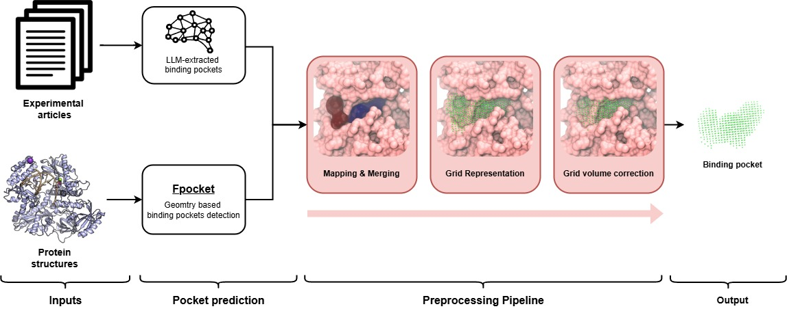

# Pocket dataset benchmark
This repository contains the code and benchmark dataset associated with the paper **Leveraging Large Language Models for Literature-Driven Prioritization of Protein Binding Pockets**.



## Data Description

This dataset compiles information on protein-ligand binding pockets, curated from scientific literature. The data is provided in two main formats: summary Excel spreadsheets and detailed JSON files for each publication.

### Summary Excel Files

Two Excel files provide an aggregated view of the data:

1.  **`LLM-benchmark-dataset/tables/pockets.xlsx`**: This file serves as a primary index and contains general information for each publication and the pockets it describes. Key columns include:
    *   `paper_id`: Unique identifier for the publication (e.g., `shen2018`).
    *   `paper_name`: Title of the publication.
    *   `DOI`: Digital Object Identifier of the publication.
    *   `target`: The main biological target studied.
    *   `pocket_id`: Identifier for a specific binding pocket within the paper.
    *   `pocket_description`: Textual details about the pocket.
    *   `ligands`: Comma-separated list of ligands associated with the pocket.
    *   `folder_name`: Folder name where the paper is located.

2.  **`LLM-benchmark-dataset/tables/amino_acids.xlsx`**: This file links specific amino acid residues to the binding pockets defined in `pockets.xlsx`. Key columns include:
    *   `paper_id`: Links back to the publication.
    *   `target`: The biological target.
    *   `pocket_id`: Links back to the specific pocket.
    *   `amino_acid`: The specific residue forming part of the pocket (e.g., `Asp375`, `A123`).


### PDB Structures
For each biological target, 1-3 PDB (Protein Data Bank) structure files are included. These aim to provide representative structural information for the target.

## Data Synchronization Utilities

A Python script, `dataset.py`, is provided to facilitate synchronization between the structured JSON files and the summary Excel spreadsheets.

**Use the following commands to manage your data:**

1.  **Excel to JSON (Updating JSONs from Excel Spreadsheets):**
    If you have made changes in `pockets.xlsx` and/or `amino_acids.xlsx` and want to reflect these in the individual JSON files:
    ```bash
    python dataset.py --update_pockets_excel_to_json
    ```
    *Action: Overwrites existing JSON files or creates new ones based on the content of `pockets.xlsx` and `amino_acids.xlsx`.*

2.  **JSON to Excel (Updating `amino_acids.xlsx` from JSONs):**
    If you have updated residue information within the JSON files and want to consolidate these changes into `amino_acids.xlsx`:
    ```bash
    python dataset.py --update_residues_json_to_excel
    ```
    *Action: Overwrites `amino_acids.xlsx` with data aggregated from all JSON files.*

3.  **JSON to Excel (Updating `pockets.xlsx` from JSONs):**
    If you have updated general pocket information (descriptions, paper metadata, etc.) within the JSON files and want to consolidate these changes into `pockets.xlsx`:
    ```bash
    python dataset.py --update_pockets_json_to_excel
    ```
    *Action: Overwrites `pockets.xlsx` with data aggregated from all JSON files.*

**Caution:** Executing these commands will overwrite the target files. It's advisable to back up your data before running synchronization scripts if you are unsure. Also, arbitraty columns in JSON or Excel are not currently supported.


## Prerequisites for LLM pocket extraction

1.  **Python 3.10**: Ensure you have Python installed.
2.  **Dependencies**: Install the required Python packages.
    ```bash
    pip install -r requirements.txt
    ```
3.  **GROBID**: This project relies on GROBID for processing PDF articles. You need to have a GROBID instance running and accessible. The easiest way is to use Docker:
    ```bash
    docker run --rm --gpus all --init --ulimit core=0 -p 8070:8070 grobid/grobid:0.8.1
    ```
4. **API Keys**: Set up your `OPENAI_API_KEY` or `GOOGLE_API_KEY`:
    ```bash
    export OPENAI_API_KEY=YOUR_KEY
    export GOOGLE_API_KEY=YOUR_KEY
    ```

## How to Run

The main script is `main.py`. It requires three positional arguments: the path to an article, the path to a PDB file, and the name of the target protein.
To run the script with default settings inside the `src` folder:

```bash
python main.py <path_to_article_file> <path_to_pdb_file> "<target_protein_name>"
```

Example:
```bash
python main.py ../examples/DHODH/liu2000.pdf ../examples/DHODH/6oc0.pdb "Dihydroorotate dehydrogenase"
```

You can override default settings in two ways:

1) **Using a Configuration File** (--config-file):  
You can provide a YAML (.yaml or .yml) or JSON (.json) file to specify multiple configuration overrides.

    Example `my_custom_config.yaml`:
    ```yaml
    extraction:
        model: "gpt-4.1-mini" # Use a different extraction model
    max_tokens: 4000 # Change max tokens
    debug: true # Enable debug
    spacing: 2.0 # Change grid spacing
    ```

    To run the script:
    ```bash
    python main.py <article_path> <pdb_path> "<target_protein>" --config-file my_custom_config.yaml
    ```

2) **Using Command-Line Overrides** (--set):  
You can override specific configuration parameters directly from the command line. For nested parameters, use dot notation (e.g., extraction.model).
    ```bash
    python main.py <article_path> <pdb_path> "<target_protein>" --set debug=True --set extraction.model="gpt-4.1-mini"
    ```